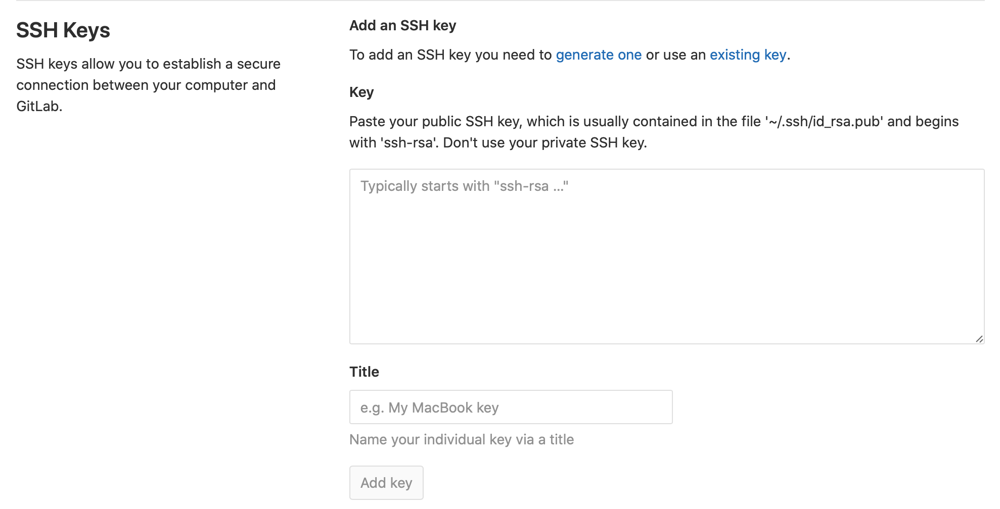

# 新增ssh

### 產生ssh

詳情請看[這裡](https://app.gitbook.com/@fogdingding/s/fogdingding-note/~/drafts/-MLk3Zs_Zvx0uRpJ3NZE/ubuntu/ssh-keygen)


順利生產完畢後，剪下公鑰`XXX.pub` 的檔案，貼到github的ssh地方。



貼完之後，透過以下指令確認是否連線成功

```text
ssh -T git@github.com
```


如果報錯，請再往下看。  
`Could not open a connection to your authentication agent.`


### 重新建立ssh以及更新私鑰

[部落客教學](https://www.cnblogs.com/Security-Darren/p/4106328.html)

```bash
ssh-keygen -t rsa -C "your_email@example.com"
ssh-agent -s
ssh-add ~/.ssh/id_rsa
## 如果報錯Could not open a connection to your authentication agent.
eval `ssh-agent -s`
ssh-add ~/.ssh/id_rsa
## 應該就能成功了

#之後再測試一次 ssh -T git@github.com
#沒問題就成功了。！！
```

