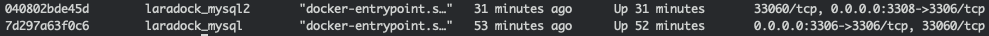
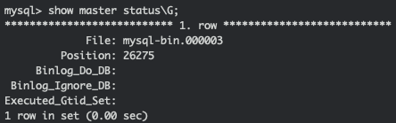
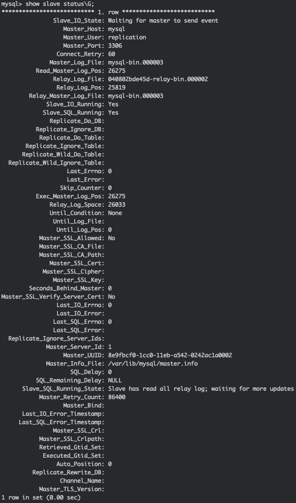

# laradock-mysql 主從設定

### 設定檔 設定

#### 修改設定檔\(docker-compose.yml\)

```bash
## copy mysql -> mysql2
volumes:
  mysql:
    driver: ${VOLUMES_DRIVER}
  mysql2:
    driver: ${VOLUMES_DRIVER}

## copy mysql -> mysql2
services:
### MySQL ################################################
    mysql:
      build:
        context: ./mysql
        args:
          - MYSQL_VERSION=${MYSQL_VERSION}
      environment:
        - MYSQL_DATABASE=${MYSQL_DATABASE}
        - MYSQL_USER=${MYSQL_USER}
        - MYSQL_PASSWORD=${MYSQL_PASSWORD}
        - MYSQL_ROOT_PASSWORD=${MYSQL_ROOT_PASSWORD}
        - TZ=${WORKSPACE_TIMEZONE}
      volumes:
        - ${DATA_PATH_HOST}/mysql:/var/lib/mysql
        - ${MYSQL_ENTRYPOINT_INITDB}:/docker-entrypoint-initdb.d
      ports:
        - "${MYSQL_PORT}:3306"
      networks:
        - backend
### MySQL2 ################################################
## 改寫 MYSQL_PORT2、DATA_PATH_HOST2、MYSQL_ENTRYPOINT_INITDB2
    mysql2:
      build:
        context: ./mysql2
        args:
          - MYSQL_VERSION=${MYSQL_VERSION}
      environment:
        - MYSQL_DATABASE=${MYSQL_DATABASE}
        - MYSQL_USER=${MYSQL_USER}
        - MYSQL_PASSWORD=${MYSQL_PASSWORD}
        - MYSQL_ROOT_PASSWORD=${MYSQL_ROOT_PASSWORD}
        - TZ=${WORKSPACE_TIMEZONE}
      volumes:
        - ${DATA_PATH_HOST2}/mysql:/var/lib/mysql
        - ${MYSQL_ENTRYPOINT_INITDB2}:/docker-entrypoint-initdb.d
      ports:
        - "${MYSQL_PORT2}:3306"
      networks:
        - backend
```

主要修改為 `volumes` 和 `services` 去複製貼上，並有些地方參數稍微修改一下，避免吃到同樣的設定檔案。

#### 修改設定檔\(.env\)

```bash
## 改寫 MYSQL_PORT2、DATA_PATH_HOST2、MYSQL_ENTRYPOINT_INITDB2

DATA_PATH_HOST=~/.laradock/data
DATA_PATH_HOST2=~/.laradock_d/data

MYSQL_VERSION=5.7
MYSQL_DATABASE=school
MYSQL_USER=gais
MYSQL_PASSWORD=GaisSchool!
MYSQL_PORT=3306
MYSQL_PORT2=3308
MYSQL_ROOT_PASSWORD=root
MYSQL_ENTRYPOINT_INITDB=./mysql/docker-entrypoint-initdb.d
MYSQL_ENTRYPOINT_INITDB2=./mysql2/docker-entrypoint-initdb.d

```

#### 複製資料夾\(mysql\)

先修改`mysql/my.cnf`

```bash
# The MySQL  Client configuration file.
#
# For explanations see
# http://dev.mysql.com/doc/mysql/en/server-system-variables.html

[client]
port        = 3306
socket      = /var/run/mysqld/mysqld.sock
 
[mysqld_safe]
socket      = /var/run/mysqld/mysqld.sock
nice        = 0

[mysqld]
sql-mode="STRICT_TRANS_TABLES,NO_ZERO_IN_DATE,ERROR_FOR_DIVISION_BY_ZERO,NO_ENGINE_SUBSTITUTION"
character-set-server=utf8
default-authentication-plugin=mysql_native_password
user            = mysql
pid-file        = /var/run/mysqld/mysqld.pid
socket          = /var/run/mysqld/mysqld.sock
port            = 3306
bind-address    = 0.0.0.0
basedir         = /usr
datadir         = /var/lib/mysql
tmpdir          = /tmp
lc-messages-dir = /usr/share/mysql
skip-external-locking

#key_buffer         = 16M
#max_allowed_packet = 16M
#thread_stack       = 192K
#max_connections    = 5000
#table_cache        = 64
#thread_concurrency = 8
#query_cache_limit  = 1M
#query_cache_size   = 16M
#query_cache_type   = 1

log_error          = /var/log/mysql/error.log
#log_slow_queries   = /var/log/mysql/mysql-slow.log
long_query_time    = 2
log-queries-not-using-indexes

server-id          = 1
log_bin            = /var/lib/mysql/mysql-bin.log
log-slave-updates  = 0
expire_logs_days   = 10
max_binlog_size    = 100M
innodb_flush_log_at_trx_commit = 1
sync_binlog        = 1
read_only          = 0

innodb_change_buffering      = all
innodb_adaptive_hash_index   = ON
innodb_max_dirty_pages_pct   = 80
innodb_buffer_pool_size      = 256M
innodb_buffer_pool_instances = 2
 
[mysqldump]
quick
quote-names
max_allowed_packet = 16M


```

再複製資料夾

```bash
cp -r mysql mysql2
```

#### 修改mysql2的設定檔\(my.cnf\)

```bash
server-id = 2
```

### docker up

```bash
docker-compose build --no-cache mysql
docker-compose build --no-cache mysql2

docker-compose up -d --build mysql mysql2
docker ps
```



成功之後就會像上面這張圖一樣，有 `3306 - > mysql` 和 `3308->mysql2`

### 設定主從Ｘ2

#### 修改mysql（主）

```bash
docker exec -it 7d297a63f0c6 bash
## in docker
mysql -u root -p

## in mysql
## mysql>

USE mysql;
CREATE USER 'replication'@'%' IDENTIFIED BY '<password>';
GRANT REPLICATION SLAVE ON *.* TO 'replication'@'%';
FLUSH PRIVILEGES;

## 如果設定錯誤(使用者)，下面的指令可以幫助你刪除它。
## DROP USER 'replication'@'%';

SHOW MASTER STATUS\G;
```

就會跑出以下的圖片，這個我們要記憶起來哦～ `File` 和 `Position`



#### 修改mysql2（從）

```bash
docker exec -it 040802bde45d bash
## in docker
mysql -u root -p

## in mysql
## mysql>

STOP SLAVE;
 
CHANGE MASTER TO
  MASTER_HOST='mysql-master',
  MASTER_USER='replication',
  MASTER_PASSWORD='<password>',
  MASTER_LOG_FILE='mysql-bin.000003',
  MASTER_LOG_POS=26275;

START SLAVE;

SHOW SLAVE STATUS\G;
```



上述 `Slave_IO_Running`: `Yes` 和 `Slave_SQL_Running`: `Yes` 就表示主從關西設定完成。  
然後如果有error上面會顯示error狀態碼跟訊息～

  


