# laravel-OAuth2

### google

#### 新增專案

登入之後，新增專案。\(點選Google Cloud Platform旁邊的按鈕\)


點選新增專案


新增完畢後


選擇專案\(剛剛建立的\)，目前我選擇的是\(My First Project\)


選完之後，搜尋`google+` 在點選 `google+ API`


啟用它


點選旁邊的清單。選擇 API和服務 -&gt; 資訊主頁


先行建立，OAuth同意的畫面。

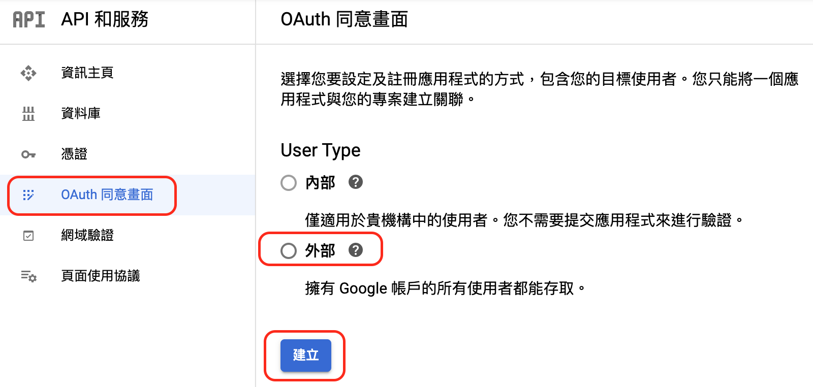

之後先行填寫應用程式名稱，使用者的電子郵件，開發人員聯絡資訊三個地方。（這裡我就跳過了，避免被發現信箱ＱＱ）


下一步，新增需要新增的資訊\(跟使用者拿哪些資訊，基本上就是不用付費審核的資料通通拿取\)

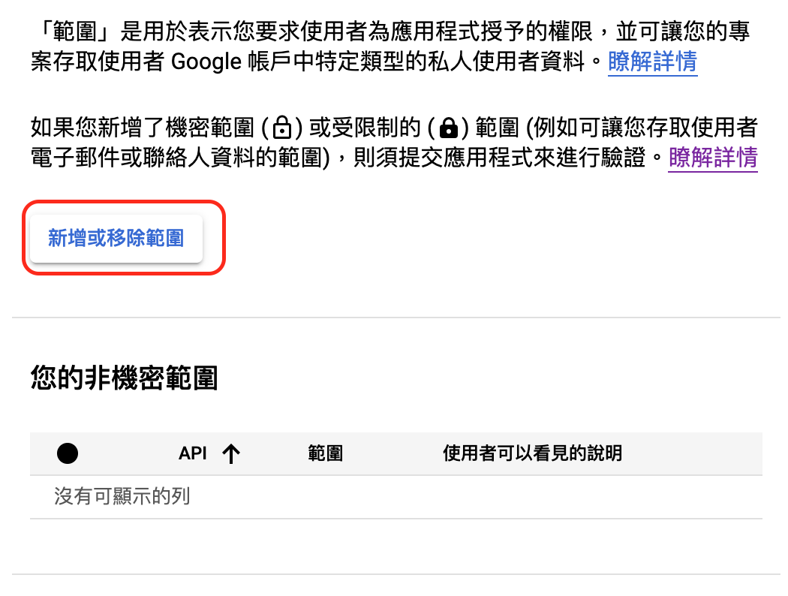

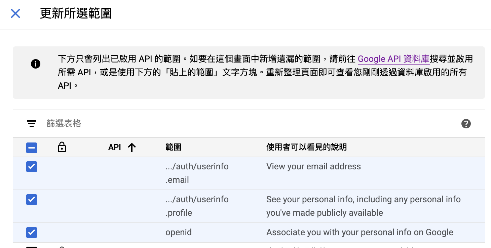


好了之後，就會跑出非機密的範圍資訊給您。就可以下一步了。

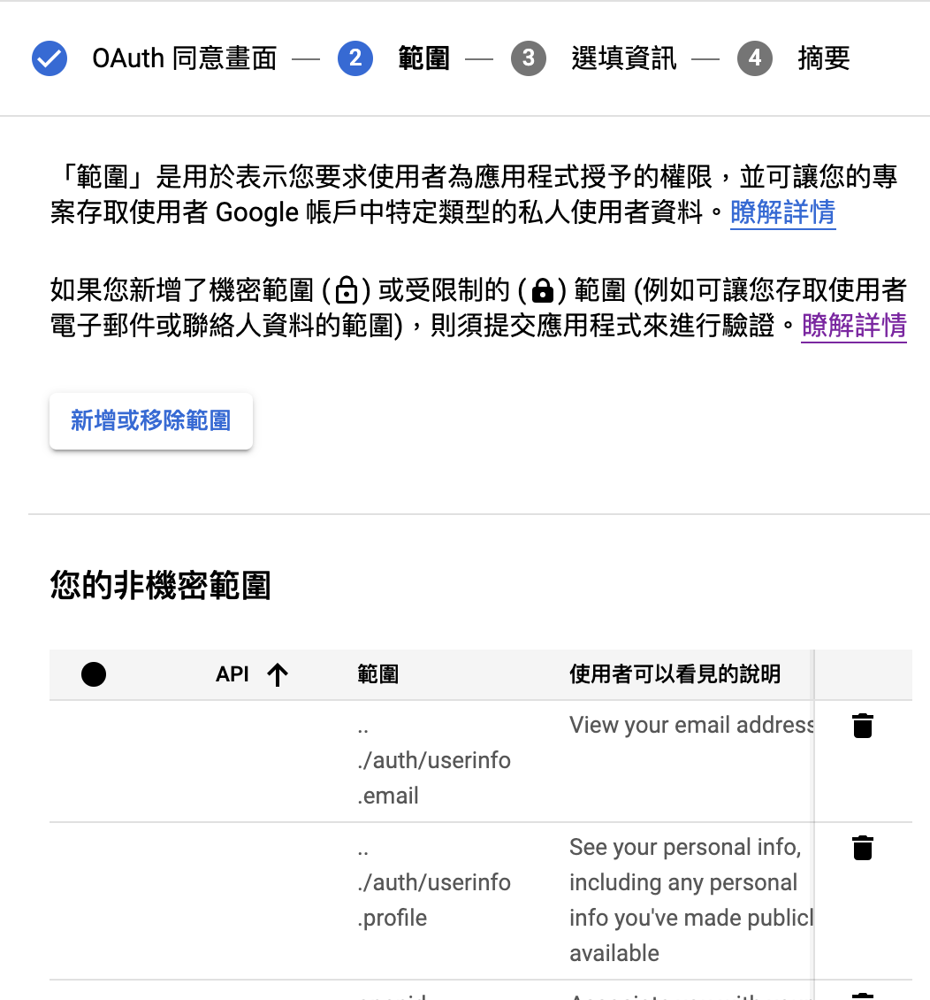

選填，在審查的時候，比較容易過關。（可以先不用填寫。

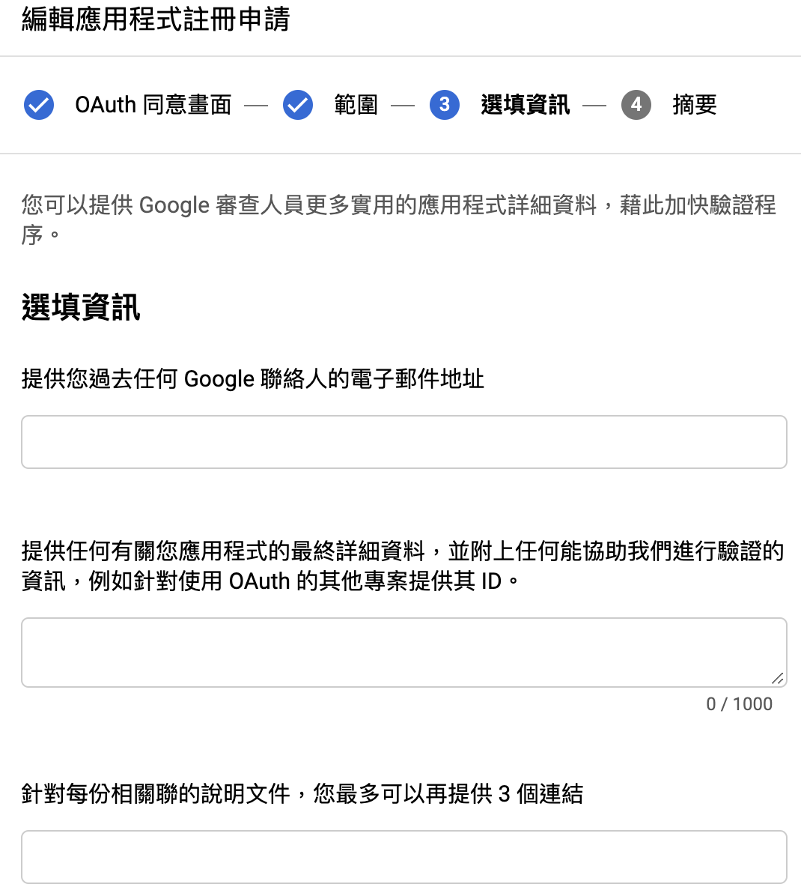

再來就是建立憑證（點選左邊的憑證）

在點選建立憑證

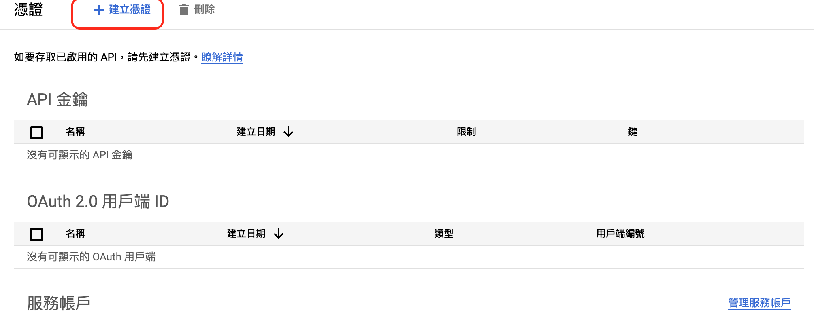

在點選，OAuth用戶端ID


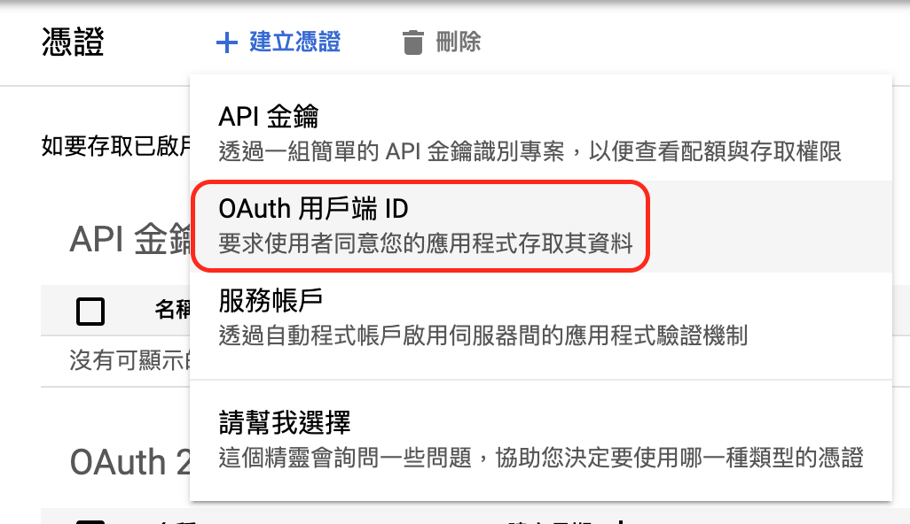

選擇網頁應用程式以及名稱

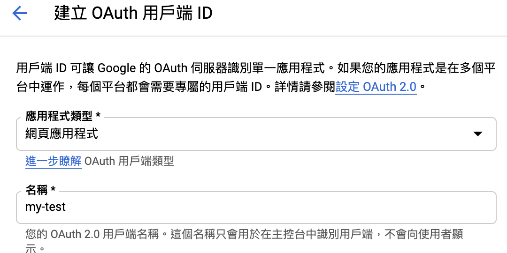


新增所需的URL\(callback\)

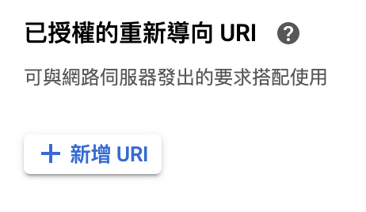


新增的URL在設定laravel的時候會告訴大家。


這樣子就完成了，另外最右邊可以下載相關設定的帳密。

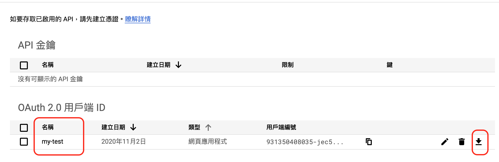


### facebook

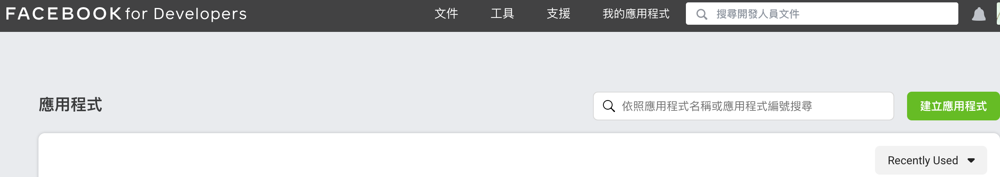

先行建立一格應用程式。


建立的時候，會跳出驗證\(判斷是不是真人\)，有時候無法出現相關驗證\(如下圖\)，換個瀏覽器種類吧...

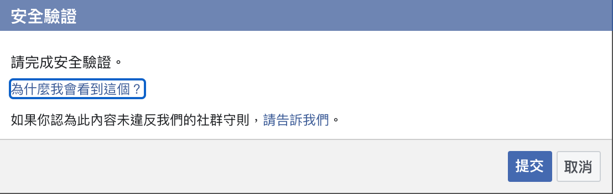


進入`test` 的主控台後，點選新增產品（facebook登入）。新增完畢後，開始設定。

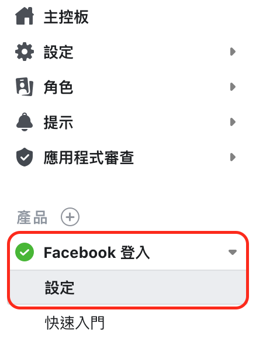

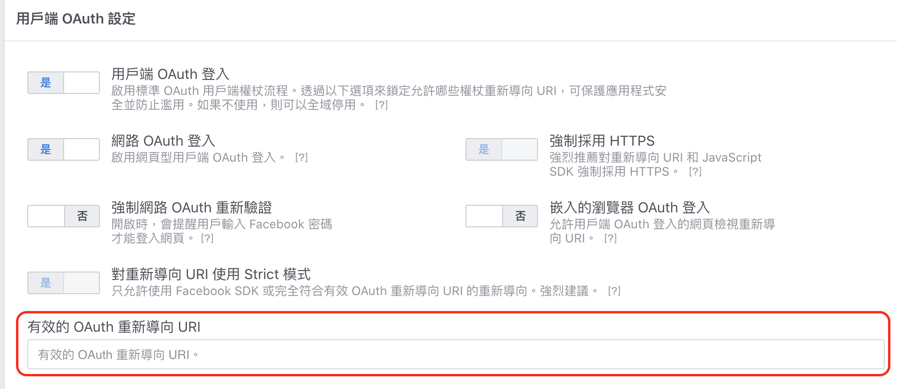


這個OAuth\(callback\)，後續設定會說laravel的時候。


另外帳號密碼在這裡

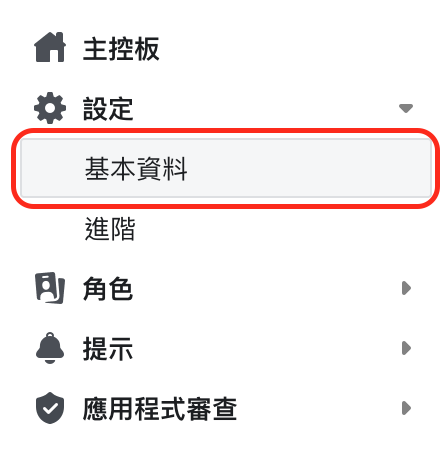

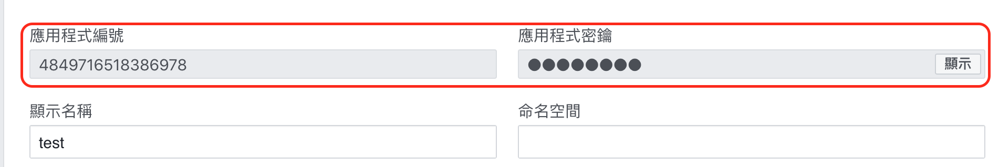

這樣就設定完畢了～

### lavavel

#### 檔案設定修正

config/auth.php

```text
    'socialite' => [
        'drivers' => [
            'google',
            'facebook'
        ],
    ],
```

config/services.php

```text

    'google' => [
        'client_id' => env('GOOGLE_CLIENT_ID'),         // Your GitHub Client ID
        'client_secret' => env('GOOGLE_CLIENT_SECRET'), // Your GitHub Client Secret
        'redirect' => env('GOOGLE_REDIRECT_URL'),
    ],

    'facebook' => [
        'client_id' => env('FB_CLIENT_ID'),
        'client_secret' => env('FB_CLIENT_SECRET'),
        'redirect' => env('FB_REDIRECT'),
    ],
```

routes/web.php

```php
Route::group(['prefix' => '/login'], function () {
    Route::get('/', 'LoginController@loginIndexPage')->name('login_page'); // 登入主頁
    Route::post('/', 'LoginController@login')->name('login_post'); // 登入主頁
    // 導向
    Route::get('redirect/{driver}', 'LoginController@redirectToProvider')
        ->name('login.provider')
        ->where('driver', implode('|', config('auth.socialite.drivers')));
    // 導向驗證
    Route::get('{driver}/callback', 'LoginController@handleProviderCallback')
        ->name('login.callback')
        ->where('driver', implode('|', config('auth.socialite.drivers')));

```

app/Http/Controllers/LoginController.php

```php
use Laravel\Socialite\Facades\Socialite;
...

class LoginController extends Controller{

    
    public function redirectToProvider($driver)
    {
        return Socialite::driver($driver)->redirect();
    }

    public function handleProviderCallback($driver)
    {
        try {
            $user = Socialite::driver($driver)->user();
        } catch (\Exception $e) {
            return redirect()->route('login');
        }

        $existingUser = User::where('email', $user->getEmail())->first();

        if ($existingUser) {
            auth()->login($existingUser, true);
        } else {
            $newUser                    = new User;
            $newUser->provider_name     = $driver;
            $newUser->provider_id       = $user->getId();
            $newUser->name              = $user->getName();
            $newUser->nickname          = $user->getName();
            $newUser->email             = $user->getEmail();
            $newUser->email_verified_at = now();
            $newUser->avatar            = $user->getAvatar();
            $newUser->permission           = 1; // teacher
            $newUser->save();

            auth()->login($newUser, true);
        }

        return redirect()->intended('/');
    }
    
    
    
    ...
}
```

.env

```php
GOOGLE_CLIENT_ID="......"
GOOGLE_CLIENT_SECRET="......"
GOOGLE_REDIRECT_URL="<APP_URL>/login/google/callback"

FB_CLIENT_ID="......"
FB_CLIENT_SECRET="......"
FB_REDIRECT="<APP_URL>/login/facebook/callback"
```

前端檔案設定

```php
// 讓他導向到web.php設定的時候即可。
<a class="ui facebook button" href="{{ route('login.provider', 'facebook') }}">
    <i class="facebook icon"></i>
    Facebook 登入
</a>

<a class="ui google button" href="{{ route('login.provider', 'google') }}">
    <i class="google icon"></i>
    Google 登入
</a>
```


還記得前兩個\(google、facebook\)的設定時候有跳過一個步驟嗎。現在把`GOOGLE_REDIRECT_URL` 和 `FB_REDIRECT` 給丟回原本要丟入的地方做驗證。


這樣子就大功告成了。


如果沒有套件`socialite`記得下指令  


```text
composer require laravel/socialite
```



### 資料來源

* [google-Cloud-Platform](https://console.cloud.google.com/)
* [facebook-developers](https://developers.facebook.com/?locale=zh_TW)
* 
