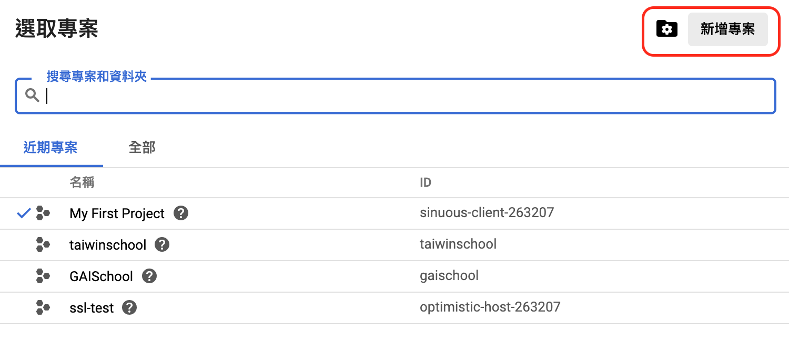
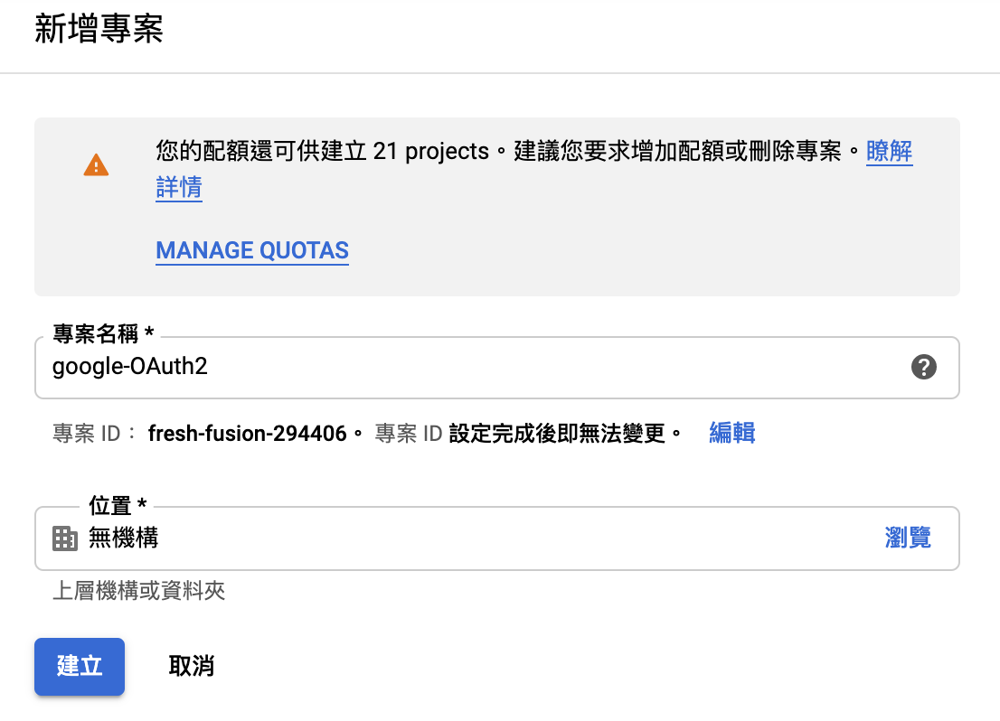
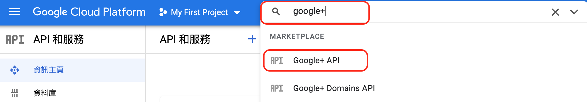
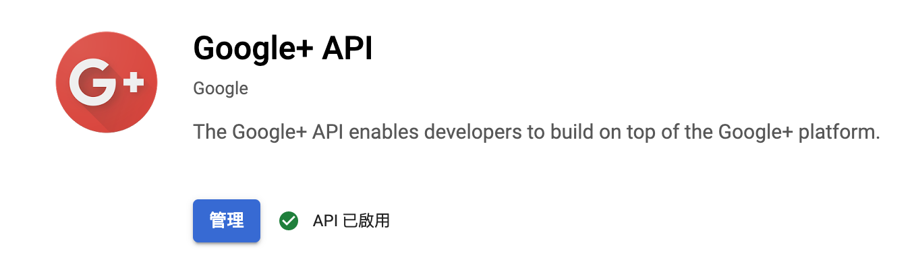
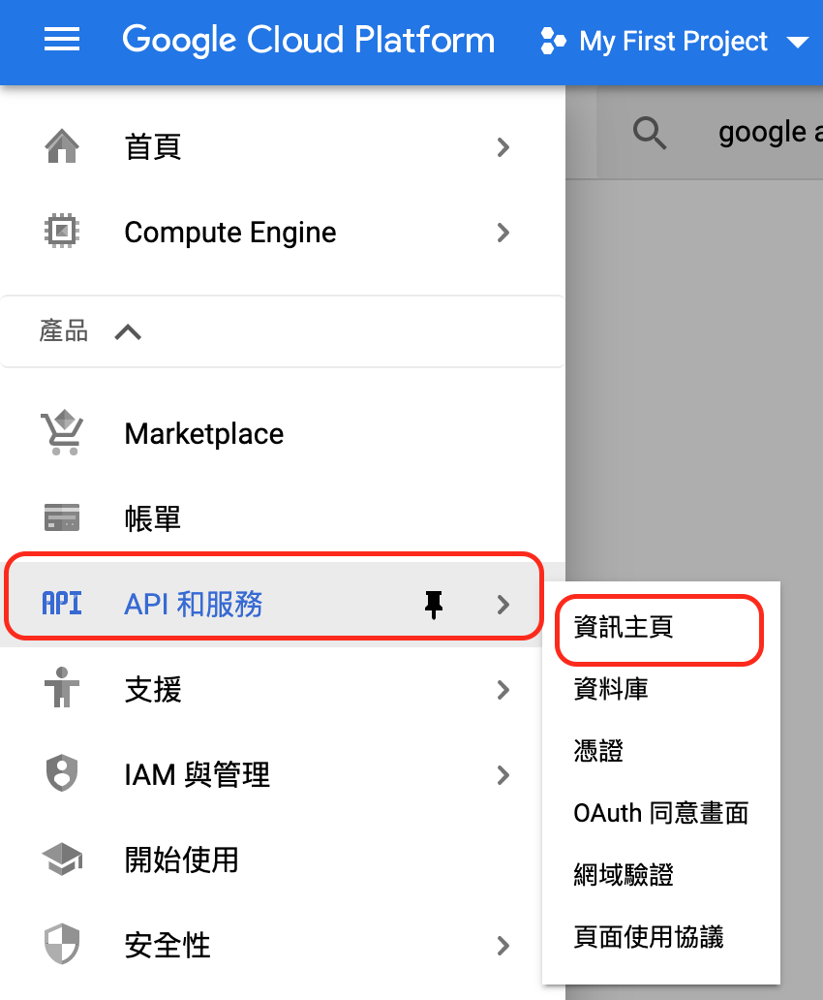

# laravel-OAuth2

### google

#### 新增專案

登入之後，新增專案。\(點選Google Cloud Platform旁邊的按鈕\)

點選新增專案

新增完畢後

選擇專案\(剛剛建立的\)，目前我選擇的是\(My First Project\)

選完之後，搜尋`google+` 在點選 `google+ API`

啟用它

點選旁邊的清單。選擇 API和服務 -&gt; 資訊主頁

### facebook

### 資料來源

* [google-Cloud-Platform](https://console.cloud.google.com/)
* 
