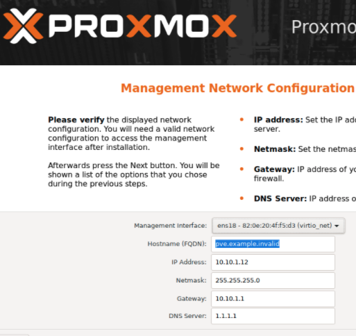

# proxmox ve

### 安裝PVE

#### 燒入隨身碟

可以使用dd

```text
sudo dd if=./proxmox-ve_6.3-1.iso of=/dev/disk2 bs=1m
```

#### 安裝PVE 

打開VT-X 才能。

同意服務條款


選擇硬碟


選擇國家跟時區


設定root帳號跟email


主機名稱及網路，這邊設定好，不然後續修改有點麻煩。



好了就開始安裝

安裝完後就可以用https://IP:8006

### 資料來源

* [官方文件](https://pve.proxmox.com/wiki/Main_Page)
* [下載載點](https://pve.proxmox.com/wiki/Downloads) 我們用6.3.1
* 
