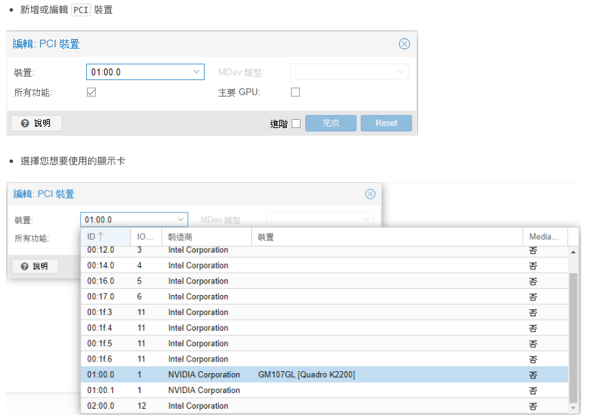
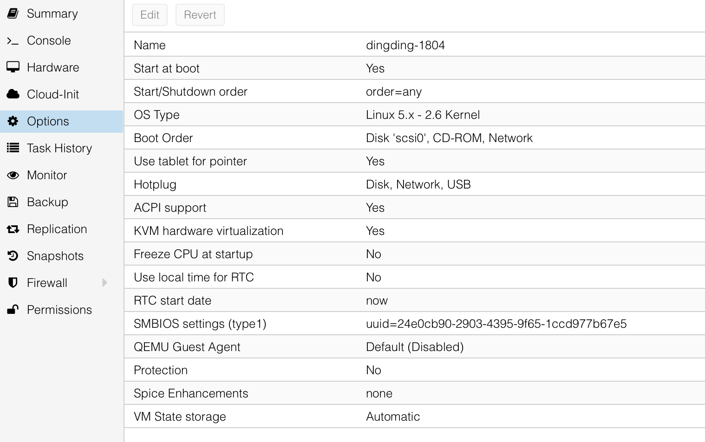

# Pci passthrough

### IOMMU打開

```bash
vim /etc/default/grub
#or
vim /etc/kernel/cmdline
#Find the line with "GRUB_CMDLINE_LINUX_DEFAULT" (for GRUB), create the file for systemd-boot (it'S format is a single line with options)
#----
#修改這一個
GRUB_CMDLINE_LINUX_DEFAULT="quiet intel_iommu=on" 
```

```bash
# update
update-grub
```

```bash
vim /etc/modules
# 新增以下資訊
vfio
vfio_iommu_type1
vfio_pci
vfio_virqfd
kvmgt
```

```bash
# update
update-initramfs -u -k all
```

重啟

### 找尋顯卡的ID

```bash
lspci -n -s 01:00
## 01:00 04:00 之類的，要看顯卡的ID位置
## lspci 慢慢看吧
```

### 將顯卡ID告知給PVE

```bash
echo "options vfio-pci ids=10de:1381,10de:0fbc" > /etc/modprobe.d/vfio.conf
```

### 新增黑名單\(禁用Nvidia Drive on host\)

```bash
echo "blacklist radeon" >> /etc/modprobe.d/blacklist.conf 
echo "blacklist nouveau" >> /etc/modprobe.d/blacklist.conf 
echo "blacklist nvidia" >> /etc/modprobe.d/blacklist.conf 
```

### 重開機

### 虛擬機建置時，注意的config設定

如果使用的是`Seabios` 就可以單獨設定這些就好

```bash
#GPU Seabios PCI Passthrough
machine: q35
hostpci0: 01:00,pcie=1,x-vga=on
#GPU Seabios PCI Express Passthrough
machine: q35
hostpci0: 01:00,pcie=1,x-vga=on


kvm open
```

或是直接網頁上設定吧





這樣子就沒問題了，再進去安裝顯卡驅動，並且執行`nvidia-smi`有跳出資訊就好了


請記住，vt-x要開、vt-d\(這個藏的很深喔\)也要開。


### 資料來源

* [官方解說](https://pve.proxmox.com/wiki/Pci_passthrough#GPU_Passthrough)

