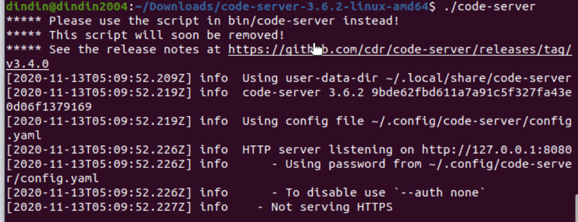
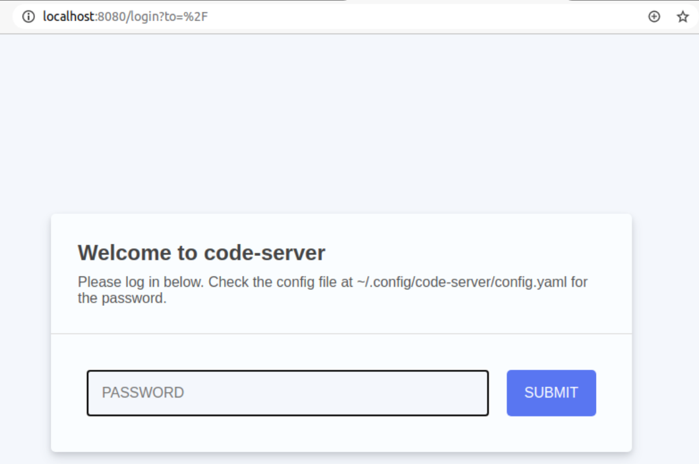

# code-server

### 資料連結

* [code-server-releases](https://github.com/cdr/code-server/releases)
* [code-server](https://github.com/cdr/code-server)
* [下載版本3.6.2](https://github.com/cdr/code-server/releases/download/v3.6.2/code-server-3.6.2-linux-amd64.tar.gz)

### 解壓縮

```bash
tar zxvf XXXX.tar.gz
```

### 進入資料夾

```bash
cd XXXX/
./code-server
```



### 打開網站\(localhost:8080\)

密碼是上面info的一串hash密碼，不過我們可以自己設定～



### 設定預設檔案

```bash
vim ~/.config/code-server/config.yaml
```

```bash
# 如果要對外，可以 0.0.0.0:8080
# 如果要對外，可以自己的IP 192.168....:8080
bind-addr: localhost:8080
auth: password
password: XXXXXXX
cert: false
```

