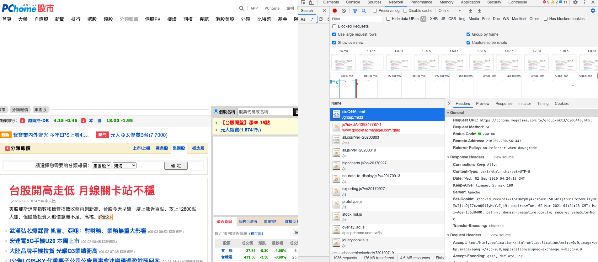
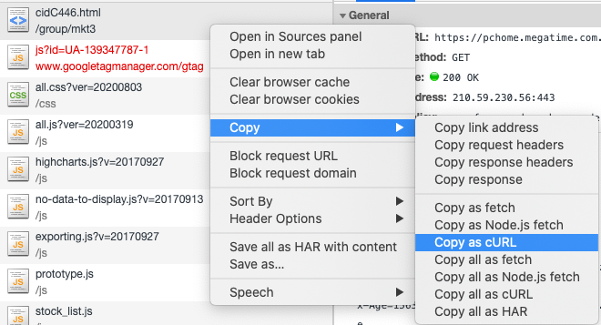
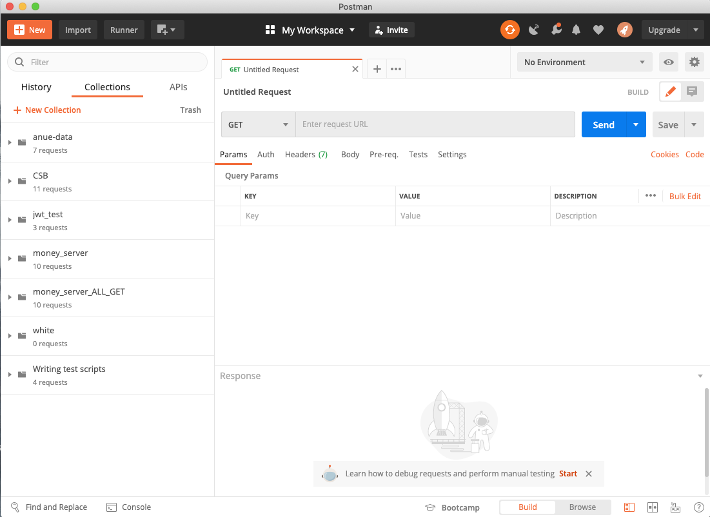
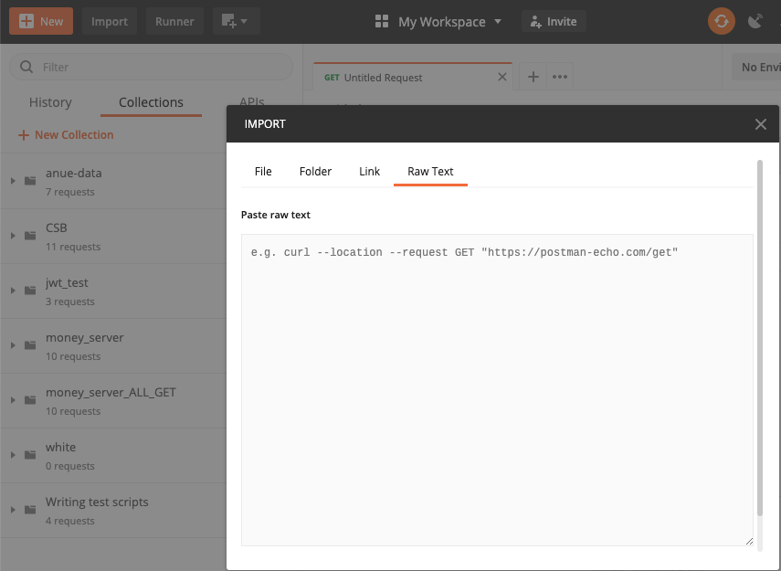
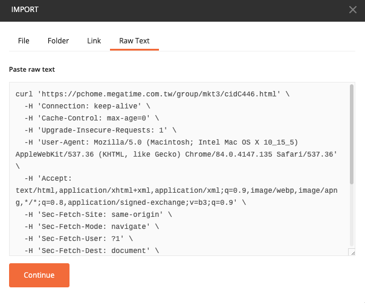
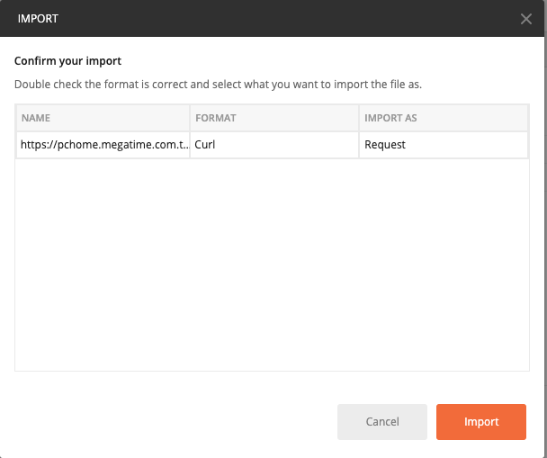
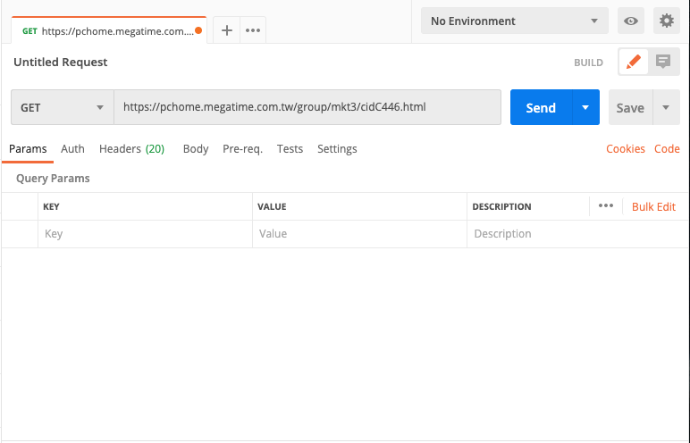
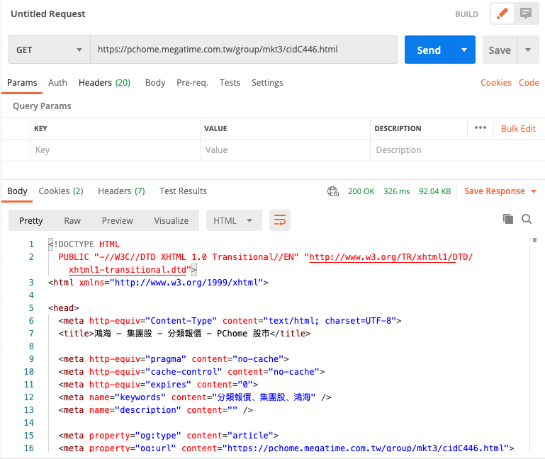
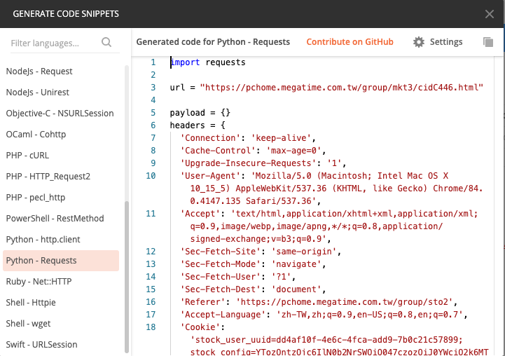

# Postman

#### 範例

選擇想要爬取的網站後，透過開發者工具來決定需要爬取的項目。

點選之後，在上面使用滑鼠點擊右鍵，點選copy -&gt; Copy as cURL

打開Postman

點選左上角的Import -&gt; 選擇Raw Text -&gt; 放入剛剛複製好的cURL -&gt; 點選Continue -&gt; 點選Import

完成之後，即可在主頁面上看到，已經替我們建立好相關設定，點選藍色按鈕\(Send\)，即可獲的資料。

#### 快速產生相關程式碼

點選畫面中的\(中間右邊\)，點選Code，在選擇需要的程式碼\(Python-Requests\)。

即可複製起來，再去python3上執行～

#### 來源資料

* [官方網站](https://www.postman.com/)

