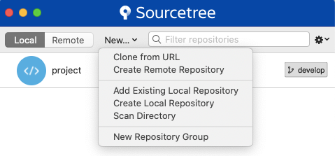
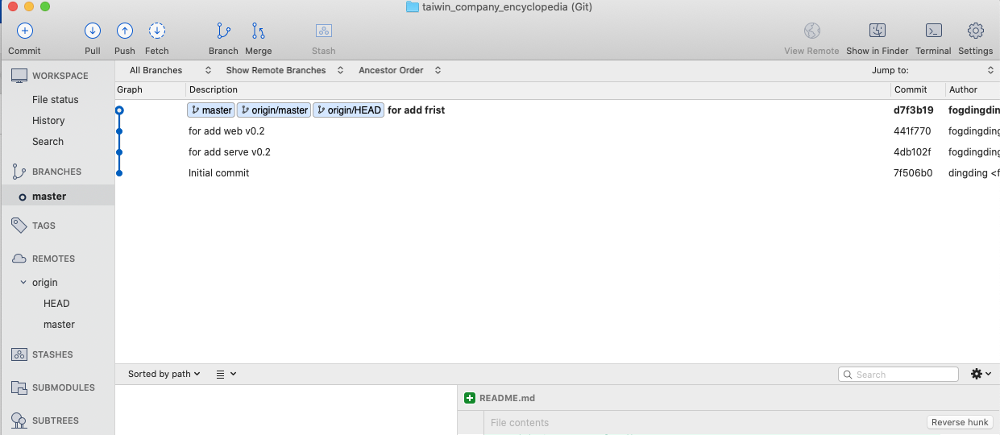

# sourcetree

寫程式的人一定會使用 Git ，使用 Git 來進行版本管控或專案合作是工程師的必備技能！而 Sourcetree 則是非常棒的輔助程式，讓您可以透過 GUI 的管理界面更好的使用 Git，因此不管您是使用 Github 還是 Gitlab 的開發者，相信這篇文章都會對您很有幫助！

### 下載安裝需求

* 官方載點下載
* 下載時段，進行[bitbucket](https://bitbucket.org/product/)註冊
* 下載完成且註冊完成，即可進行安裝，安裝過程中會要求登入帳號密碼來獲取授權。
* 完成後，會看到以下畫面（目前用mac來進行示範）

sourcetree的應用畫面，主要按鈕

* clone from URL
  * 類似git clone
* Create Remote Repository
  * git remote add...
* add Existing Local Repository
  * 新增已經存在本地端的git專案（匯入）
* Crete Local Repository
* Scan Directory
* New Repository Group

點選add Existing Local Repository（之前已經git clone下來了），畫面就會像是這樣

之後就能透過左邊的工具列來進行操作。

### 工具使用教學，待補

### 資料來源

* [官方網站](https://www.sourcetreeapp.com/)
* [官方註冊](https://bitbucket.org/product/)
* [參考](https://medium.com/samumu-clan/%E7%94%A8-sourcetree-%E5%AF%A6%E7%8F%BE%E5%9F%BA%E7%A4%8E%E7%89%88%E6%9C%AC%E7%AE%A1%E6%8E%A7-b007254e95c5)
* [參考網站](https://medium.com/samumu-clan/%E7%94%A8-sourcetree-%E5%AF%A6%E7%8F%BE%E5%9F%BA%E7%A4%8E%E7%89%88%E6%9C%AC%E7%AE%A1%E6%8E%A7-b007254e95c5)

