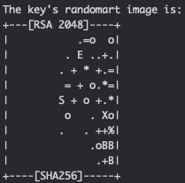

# ssh-keygen

### 產生ssh key

```bash
cd ~/.ssh
ssh-keygen -f test -P '' -N ''
```

就能產生公私密鑰了



如果不加入參數，預設會放在`/home/username/.ssh/id_rsa`....


因為加了參數，所以會放在執行ssh-keygen的地方。


### 複製ssh key

```bash
ssh-copy-id -i test.pun -p <port> <user>@<domain>
# 這邊會問一次，然後幫你把資料放入 ~/.ssh/authorized_keys
```


把公鑰\(test.pub\)放入目的登入機器上的`~/.ssh/authorized_keys` 寫入。


### 建立config

```bash
cd ~/.ssh
vim config
```

#### config

```bash
# test
Host test
  Hostname 140.111.111.111
  User test
  Port 1111
  IdentityFile ~/.ssh/test
# test
```

###  測試 ssh

```bash
ssh test
```


如果不用密碼，就成功羅～


### 常用參數

| 參數 | 備註 |
| :--- | :--- |
| -t | 密鑰生成的類型，預測為SSH2d\_rsa |
| -f | 密鑰文件的名稱 |
| -P | 提供舊密碼，空代表不需要密碼 |
| -N | 提供新密碼，空代表不需要密碼 |
| -b | 指定密鑰的長度 |
| -C | 提供一個新的註解 |

### 資料來源

* [參數介紹](https://www.itread01.com/content/1527598583.html)
* [部落客教學](https://xenby.com/b/220-%E6%95%99%E5%AD%B8-%E7%94%A2%E7%94%9Fssh-key%E4%B8%A6%E4%B8%94%E9%80%8F%E9%81%8Ekey%E9%80%B2%E8%A1%8C%E5%85%8D%E5%AF%86%E7%A2%BC%E7%99%BB%E5%85%A5)

