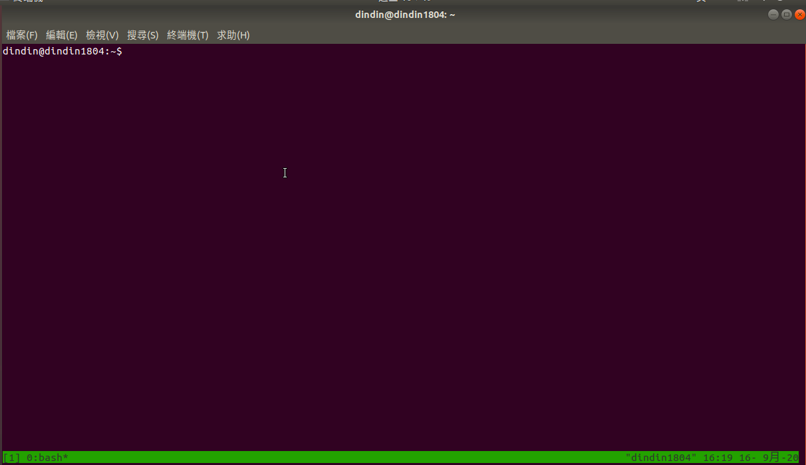
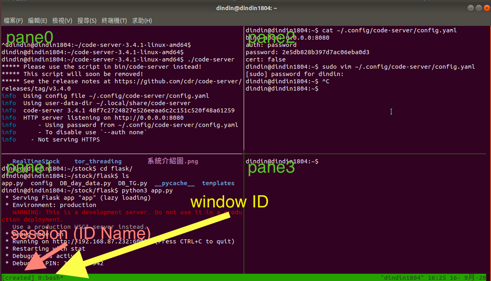

# tmux

### 安裝tmux

```text
sudo apt-get install tmux
```

### 使用教學

```text
tmux
```

底部就會多一條線



### 基本觀念

當執行`tmux` 指令時候，會建立一個session，在一個sesion中可以建立多個windows，而windows則可以分割出很多的panes。其中使用＊來代表目前的windows位置



### 分割視窗

| 組合鍵 | 說明 |
| :--- | :--- |
| `ctrl`+`b`再輸入`%` | 垂直分割視窗。 |
| `Ctrl`+`b` 再輸入 `"` | 水平分割視窗。 |
| `Ctrl`+`b` 再輸入 `o` | 以輪流方式輪流切換 pane。 |
| `Ctrl`+`b` 再輸入 `方向鍵` | 切換至指定方向的 pane。 |
| `Ctrl`+`b` 再輸入 `空白鍵` | 切換佈局。 |
| `Ctrl`+`b` 再輸入 `!` | 將目前的 pane 抽出來，獨立建立一個 window 視窗。 |
| `Ctrl`+`b` 再輸入`x` | 關閉目前的 pane。 |

### windows

| 組合鍵 | 說明 |
| :--- | :--- |
| `ctrl`+`b`再輸入`c` | 建立新 window 視窗（create）。 |
| `ctrl`+`b`再輸入`w` | 以視覺化選單切換 window 視窗（很好用）。 |
| `ctrl`+`b`再輸入`n` | 切換至下一個 window 視窗（next）。 |
| `ctrl`+`b`再輸入`p` | 切換至上一個 window 視窗（previous）。 |
| `ctrl`+`b`再輸入`數字鍵` | 切換至指定的 window 視窗。 |
| `ctrl`+`b`再輸入`&` | 關閉目前的 window 視窗。 |

### sessions

| 組合鍵 | 說明 |
| :--- | :--- |
| `ctrl`+`b`再輸入`$` | 重新命名目前的 session。 |
| `ctrl`+`b`再輸入`d` | 分離目前的 session（detach），離開 tmux 環境。 |
| `ctrl`+`b`再輸入`s` | 以視覺化選單切換 session（select，很好用）。 |
| `ctrl`+`b`再輸入`L` | 切換至上一個使用過的 session。 |
| `ctrl`+`b`再輸入`(` | 切換至上一個 session。 |
| `ctrl`+`b`再輸入`)` | 切換至下一個 session。 |

### 常使用按鍵

```bash
# ============================================================
# bash
# 查看目前有的session
tmux ls
# 選擇要進入的session
tmux attach -t <sessionID>
# ------------------------------------------------------------

# ============================================================
# session
# ctrl+b再輸入$         重新命名
# ctrl+b再輸入d         離開tmux環境
# ctrl+b再輸入s         視覺話選擇seesion
# ------------------------------------------------------------

# ============================================================
# windows
# ctrl+b再輸入c         創立
# ctrl+b再輸入w         視覺化選擇視窗
# ctrl+b再輸入數字鍵     直接指定視窗
# ctrl+b再輸入&         關閉目前的視窗
# ------------------------------------------------------------

# ============================================================
# panes
# ctrl+b再輸入%         垂直分割視窗
# ctrl+b再輸入"         水平分割視窗
# ctrl+b再輸入方向鍵     切換指定方向的pane
# ctrl+b再輸入x         關閉pane
# ------------------------------------------------------------
```

### 資料來源

* [使用教學](https://blog.gtwang.org/linux/linux-tmux-terminal-multiplexer-tutorial/)

