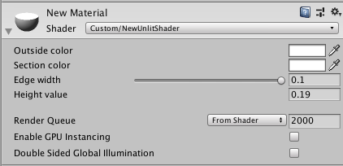

# Shaders-Section範例

#### 創建物件

建立完Unity的一個3D範例後，進入至Assets資料夾內後。

```text
.
├── Scenes
│   ├── SampleScene.unity
│   └── SampleScene.unity.meta
└── Scenes.meta
```

在此資料夾內新增以下檔案

* New Material.mat
* NewUnlitShader.shader


在SampleScene.unity內部新增一個3D Object Cube


#### 編輯程式碼

於NewUnlitShader.shader修改程式碼

```text
Shader "Custom/NewUnlitShader" {
 
    Properties {
        _Color1 ("Outside color", Color) = (1.0, 1.0, 1.0, 1.0)
        _Color2 ("Section color", Color) = (1.0, 1.0, 1.0, 1.0)
        _EdgeWidth ("Edge width", Range(0.9, 0.1)) = 0.9
        _Val ("Height value", float) = 0
    }
 
    SubShader {
        Tags { "Queue"="Geometry" }
 
        //  PASS 1
        CGPROGRAM
        #pragma surface surf Standard
 
        struct Input {
            float3 worldPos;
        };
 
        fixed4 _Color1;
        float _Val;
 
        void surf(Input IN, inout SurfaceOutputStandard o)
        {
            if(IN.worldPos.y > _Val)
                discard;
            o.Albedo = _Color1;
        }
 
        ENDCG
 
        //  PASS 2
        Pass {
 
            Cull Front
 
            CGPROGRAM
            #pragma vertex vert
            #pragma fragment frag
            #include "UnityCG.cginc"
 
            struct v2f {
                float4 pos : SV_POSITION;
                float4 worldPos : TEXCOORD0;
            };
 
            v2f vert(appdata_base v)
            {
                v2f o;
                o.pos = mul(UNITY_MATRIX_MVP, v.vertex);
                o.worldPos = mul(unity_ObjectToWorld, v.vertex);
                return o;
            }
 
            fixed4 _Color2;
            float _Val;
 
            fixed4 frag(v2f i) : SV_Target {
                if(i.worldPos.y > _Val)
                    discard;
 
                return _Color2;
            }
 
            ENDCG
        }
 
        //  PASS 3
        Pass {
            CGPROGRAM
            #pragma vertex vert
            #pragma fragment frag
            #include "UnityCG.cginc"
 
            struct v2f {
                float4 pos : SV_POSITION;
                float4 worldPos : TEXCOORD0;
            };
 
            float _EdgeWidth;
 
            v2f vert(appdata_base v)
            {
                v2f o;
                v.vertex.xyz *= _EdgeWidth;
                o.pos = mul(UNITY_MATRIX_MVP, v.vertex);
                o.worldPos = mul(unity_ObjectToWorld, v.vertex);
                return o;
            }
 
            fixed4 _Color2;
            float _Val;
 
            fixed4 frag(v2f i) : SV_Target {
                if(i.worldPos.y > _Val)
                    discard;
 
                return _Color2;
            }
 
            ENDCG
        }
 
        //  PASS 4
        Cull Front
 
        CGPROGRAM
        #pragma surface surf Standard vertex:vert
        struct Input {
            float3 worldPos;
        };
 
        float _EdgeWidth;
 
        void vert(inout appdata_base v)
        {
            v.vertex.xyz *= _EdgeWidth;
        }
 
        fixed4 _Color1;
        float _Val;
 
        void surf(Input IN, inout SurfaceOutputStandard o)
        {
            if(IN.worldPos.y > _Val)
                discard;
 
            o.Albedo = _Color1;
        }
 
        ENDCG
    }
}
```

#### 物件指向

* 將NewUnlitShader.shader指向New Material.mat
* 將New Material.mat指向Cube

備註：拖拉檔案至目標即可自動指向。

完成會如下圖


點選Cube並查看右下角即可進行拖拉改變Cube的切面狀況。




#### 資料來源

* [Shaders Laboratory](https://www.youtube.com/channel/UCDk9-aPr8zQzwi4ylnuoJ6w)[Section Shaders](https://www.youtube.com/watch?v=AhC6ueyny2I)
* [write Shaders](https://www.youtube.com/watch?v=bR8DHcj6Htg)
* [sample](https://www.shadertoy.com/results?query=&sort=popular)
* [shaders lab](http://www.shaderslab.com/index.html)

