# unity-ios-App

#### 安裝與註冊

於[官網](https://unity.com/) 進行下載並安裝。  
於[官網](https://id.unity.com/en/conversations/97d5e839-f0fd-4bc9-9a9c-5df2445bdf5e00df) 進行註冊

#### 簡單介紹

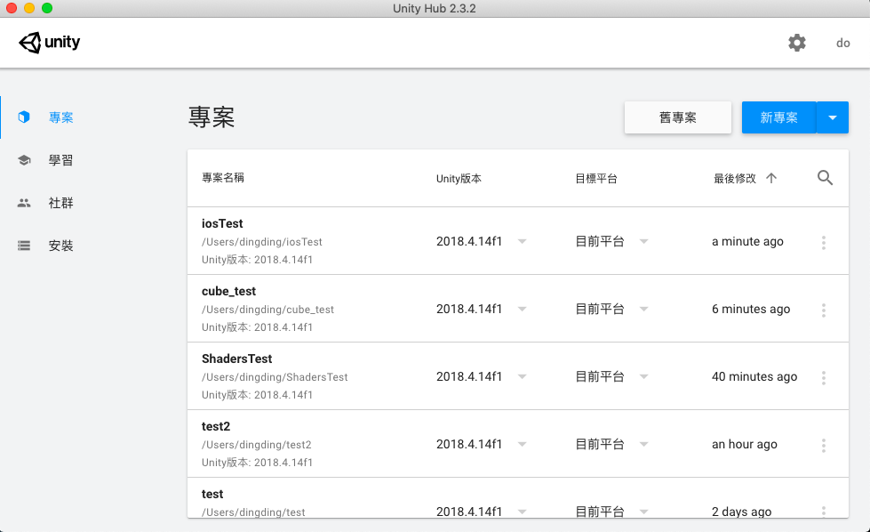

* 專案
  * 控管專案的地方
* 學習
  * 官網提供一些基礎功能的介紹教學
* 社群
  * 透過社群的力量來進行議題或問題的發問與解答
* 安裝
  * 透過套件來進行相關軟體的安裝。

#### 管理授權

在管理介面的右上角齒輪（設定）點選後，點擊授權管理即可進行更新或是查看（避免無法使用Unity）

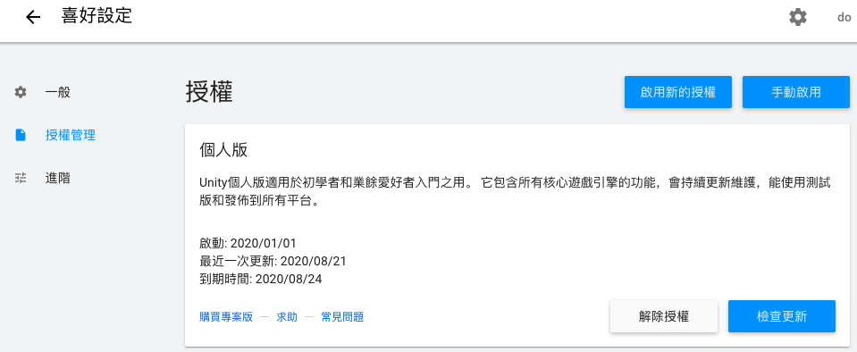

#### 軟體安裝

點選管理介面的左邊控制列裡面的安裝後，點選已安裝的版本上的三個小點點後進行相關套件的安裝（勾選）。（安裝時間會蠻久的）

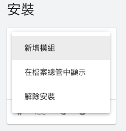

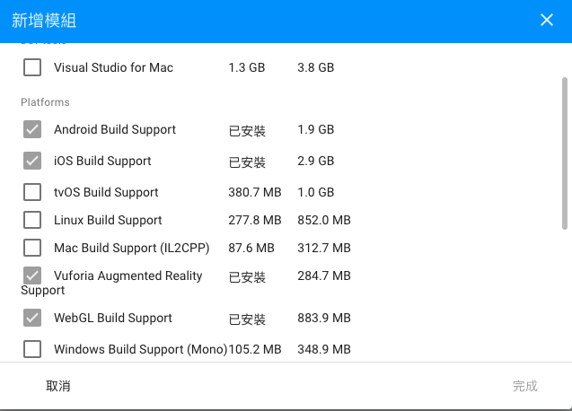

#### 開始建立第一隻APP

從管理介面選擇新增專案後，輸入名稱（本教學已經建立完畢）。

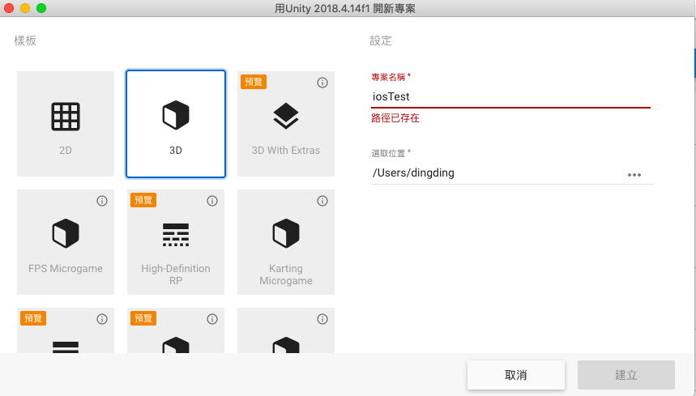

即可看到Unity的開發介面

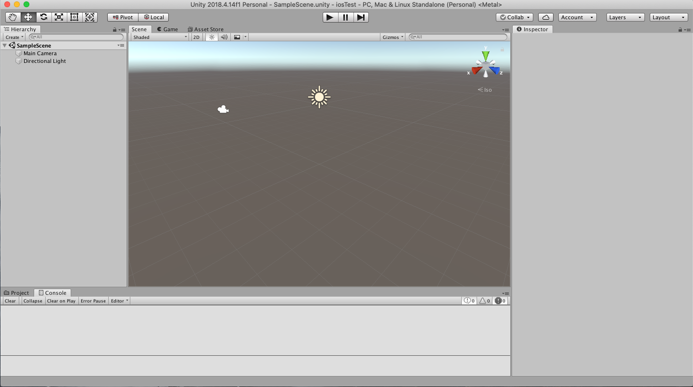

在左邊的SampleScene地方新增一個3D物件-Cube

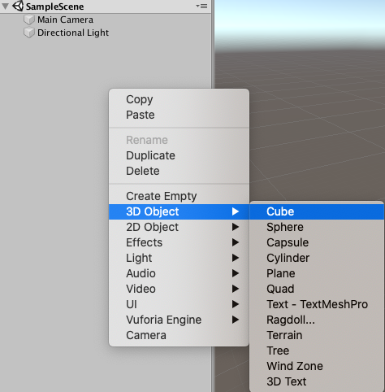

稍微調整一下Main Camera 跟 Cube的相互位置（Camera 能夠順利看到Cube\)。

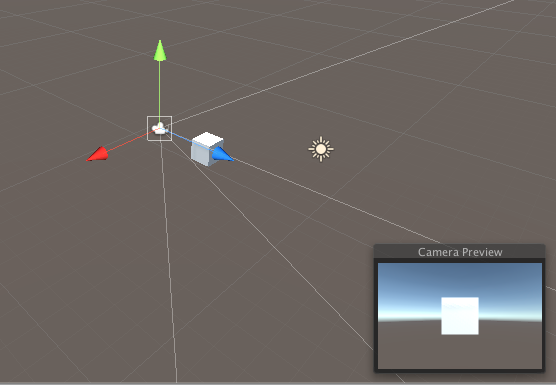

中間的播放按鈕，點選之後能夠順利看到一個立方體即代表成功。

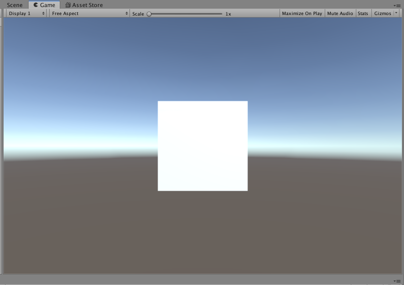

#### 輸出成App檔案

點選File &gt; Build setting。

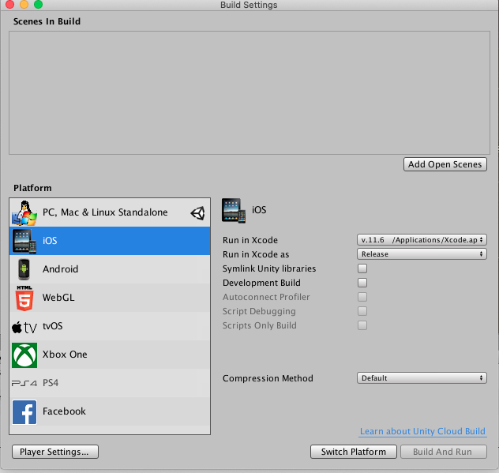

Run in Xcode 選擇mac上的Xcode來進行編譯。  
點選IOS以及Switch platform 再點選Player Settings，即可看到下列圖表（右手邊）

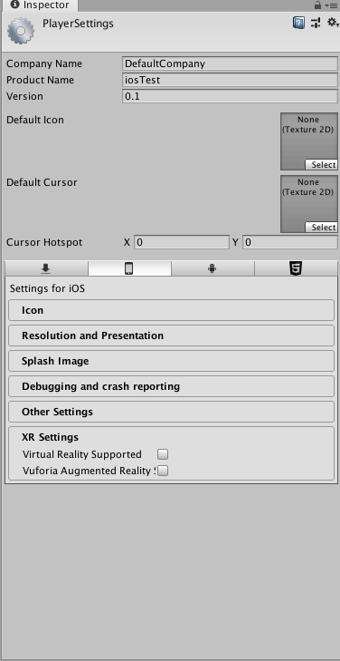

這邊比較特別，不知道Unity為何要如此設計。  
需要更改名稱的有兩個地方。

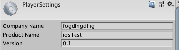

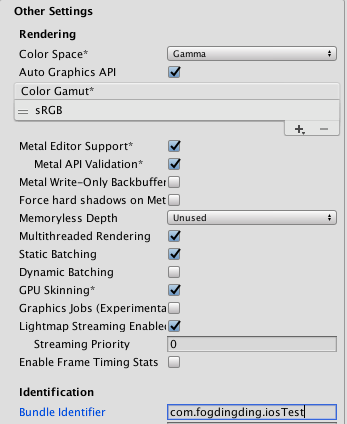

將Company Name 以及 ProductName 改成自己想要的之後。  
在下面的Other Settings的 Identification 內的 Bundle Identifier 需要改成相同的名稱。  
com.Company Name.ProductName

之後即可開始進行編譯，但是因為Ios比較特別，需要使用Mac電腦，Apple公司內開發的Xcode才行哦～[下載來源](https://apps.apple.com/us/app/xcode/id497799835?mt=12)

完成上述設定之後，就能回到Build Settings 按下Build了。（這邊會運行比較久）

#### 讀取APP檔案

開啟Xcode 後 針對剛剛儲存的路徑進行讀取。（要讀取剛剛Unity產生出的檔案夾位址）  
讀取完之後，能看到以下圖表。

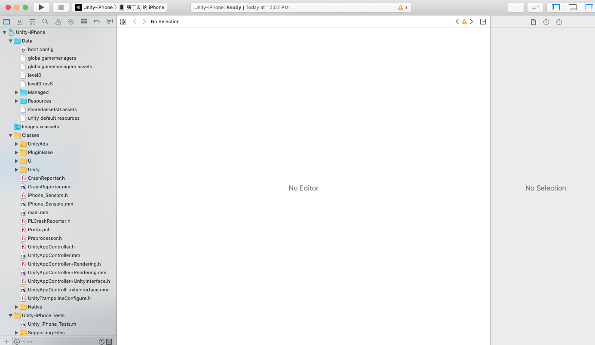

在左上角選擇Unity-Iphone &gt; 我的Iphone（這邊需要手機有線的連接至Mac上面）。  
即可按下播放鍵（開始編譯）。  
這時候應該會發生錯誤，主要錯誤是因為我們還需要指定開發人員是誰（基於Ios-APP的安全性議題吧，出了事情能夠快速的追蹤是誰開發的？）

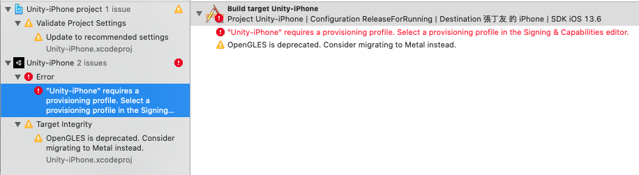

如需要解決這個問題，我們只需要指定開發人員即可。  
修正（指定）開發人員

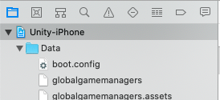

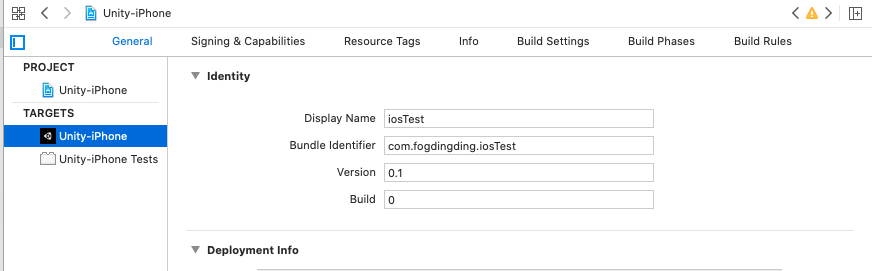

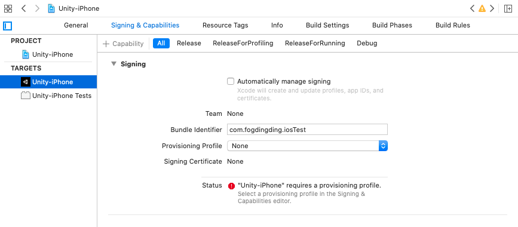

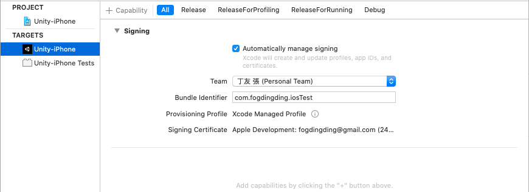

在上圖點選Singing&Capabilites後  
勾選Automatically manage Signing  
即可選擇開發人員（這邊需要登入自己的APPLE ID）哦  
完成後即可再次按下播放鍵（編譯）。這次應該就能成功了。（在途中可能會需要打開IPhone的安全性設定，供APP能夠在手機上執行）

備註：編譯過程中會出現很多warning，是正常的（？）

#### Iphone

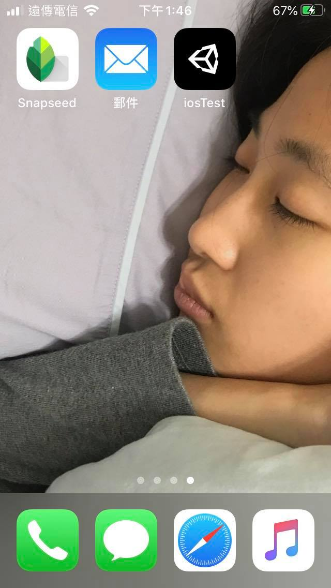

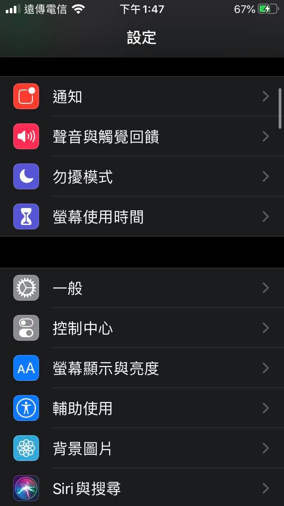

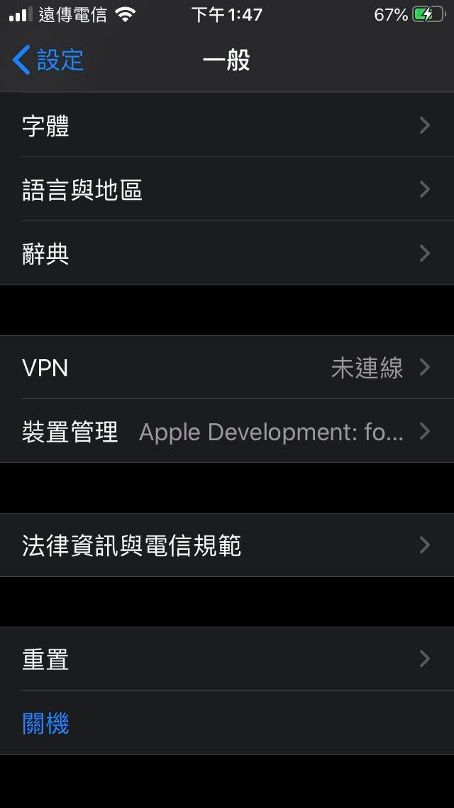

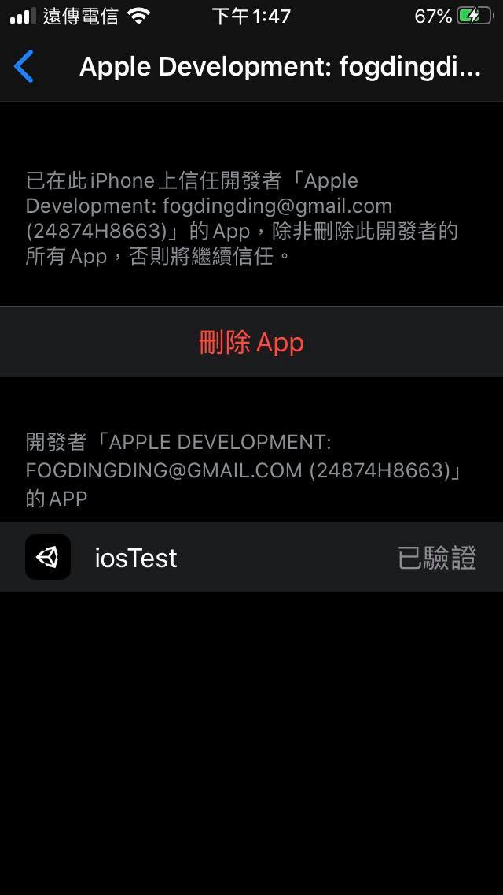

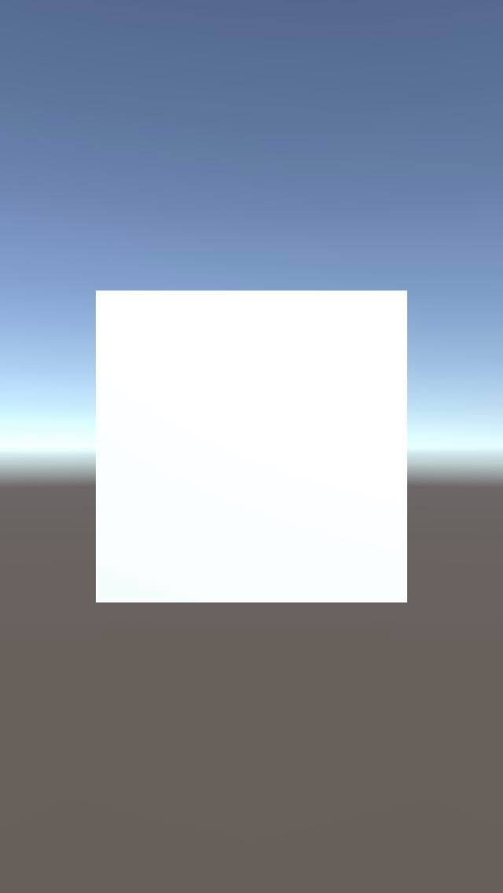

  

