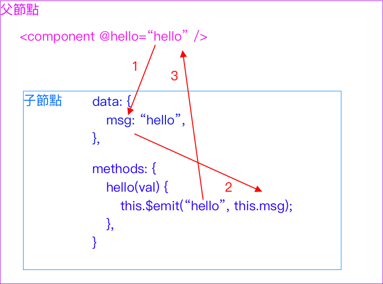

# Component-傳遞資料\(props、emit\)

## props in, emit out

### props in

今天我們要把資料從父節點傳入子節點的時候，我們在子結點會使用props來去接收父節點所傳入的資料。


這樣子，我們在子節點的時候，就能順利使用`msg` 了

ＰＳ：靜態傳遞與動態傳遞（`：`是很重要的喔）

```javascript
# 靜態傳遞
<component msg="Welcome Vue.js" />
# 動態傳遞 當中的msg是拿data裡面的。
<component :msg=msg />
```

### emit out

今天如果我們要把資料從子節點傳入到父節點的時候，事情就比較麻煩一點點了。\(因為props是單向傳輸資料，所以禁止直接去修改。\)

引此我們要利用`emit` 來幫我們處理這一件事情。  
首先在父節點上建立`@hello="hello"` 來進行一個hello函數的運行，但是傳遞給hello的數值哪來呢？  
因此我們要在子節點上建立$emit\("傳給hello"，"數值為hello"\)。（以下圖片須執行到子節點hello函數才行）  
最後再由父節點的hello函數來運行。



有點不清楚嗎？沒關係我們來看下面一張圖。

### props in emit out

Step1:首先我們一樣在父節點上傳入值，子節點接收\(props\)  
Step2:然後命名msgChild來接收props傳進來的msg。（規避無法直接在props修改數值）  
Step3:把數值傳給$emit  
Step4:指令父節點的事件\(hello函數\)為何，並傳出剛剛指定的數值\(Step3\)  
Step5:最後再由父節點上的事件\(hello\)來執行要執行的任務。


### [資料來源](https://ithelp.ithome.com.tw/articles/10223518)

