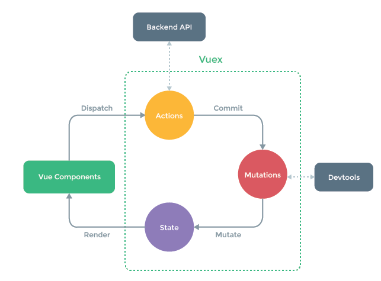

# vuex

有時候我們可能會需要在不同的`container` 上去使用同一個狀態\(state\)變數。因此`vuex` 將會完美的替我們解決。以下為其觀念圖



## 開始教學

### 建立store

建立store，在`/src/store/` 下建立幾個檔案。

```javascript
// src/store/index.js
import { createStore } from 'vuex';
import createPersistedState from 'vuex-persistedstate';
import reducer from './vuexReducer';

import user from './modules/user';

export default createStore({
  state: {},
  mutations: {},
  actions: {},
  modules: {
    user,
  },
  plugins: [
    createPersistedState({
      key: 'VuexStorage',
      storage: window.localStorage,
      reducer,
    }),
  ],
});

```

```javascript
// src/store/vuexReducer.js
export default function (val) {
  return {
    user: val.user,
  };
}

```

```javascript
// src/store/modules/user.js
// ps: 建立資料夾modules，方便控管modules

const defaultState = {
  data: null,
};

const mutations = {
  setUserData(state, data) {
    state.data = data;
  },
  clearUserData(state) {
    state.data = null;
  },
  resetUserData(state, data) {
    state.data.name = data.name;
    state.data.email = data.email;
    state.data.position = data.position;
    state.data.place = data.place;
    state.data.public_contact = data.public_contact;
  },
  resetKeywords(state, keywords) {
    state.data.keywords = keywords;
  },
};

const actions = {
  login({ commit }, data) {
    commit('setUserData', data);
  },
  logout({ commit }) {
    commit('clearUserData');
  },
  reset({ commit }, data) {
    commit('resetUserData', data);
  },
  refreshKeywords({ commit }, keywords) {
    commit('resetKeywords', keywords);
  },
};

export default {
  namespaced: true,
  state: defaultState,
  actions,
  mutations,
};

```

### main.js引用

```javascript
// src/main.js
import { createApp } from 'vue';

import App from './App';
import router from './router';
import store from './store';

const app = createApp(App);

app.use(store).use(router).use(VueLazyLoad).mount('#app');

```

### 某一個components

```javascript
<template>
  ...
  {{ data }}
  ...
</template>

<script>
import { useStore } from 'vuex';
export default {
  setup() {
    const store = useStore();
    const data = store.dispatch('user/login', result.data);
    return {
      data,
    }
  },
}
</script>
```

### 流程介紹

首先我們會在某一個`components`裡面去引用`vuex` \(`import { useStore } from 'vuex';`\)，然後宣告\(`const store = useStore();`\)，並使用\(`store.dispatch('user/login', result.data);`\)去呼叫`user.js` 內的 `actions` 的 `login` 函數。 

接下來會在呼叫內部的 `mutation`的函數作為運作，去修改內部資料或其他操作。

### 模型介紹

每一個`vues` \(`index.js`\)內都會有五種屬性

* \*\*\*\*[**State**](https://next.vuex.vuejs.org/guide/state.html)\*\*\*\*
  * **主要用來存放狀態**
* \*\*\*\*[**Getters**](https://next.vuex.vuejs.org/guide/getters.html)\*\*\*\*
  * **主要用來獲取狀態Sate內的資料**
* \*\*\*\*[**Mutations**](https://next.vuex.vuejs.org/guide/mutations.html)\*\*\*\*
  * **函數，負責修改狀態**
* \*\*\*\*[**Actions**](https://next.vuex.vuejs.org/guide/actions.html)\*\*\*\*
  * **函數，負責呼叫**Mutations
* \*\*\*\*[**Modules**](https://next.vuex.vuejs.org/guide/modules.html)\*\*\*\*
  * 可以把上面四個打包成一個模組化的系統，如同上面的範例。

### 參考連結

* [官方連結](https://next.vuex.vuejs.org/)

